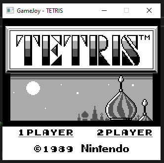

# GameJoy
GameJoy is a Game Boy emulator being developed in C++.  
To test the emulator, I've been using the individual test ROMs created by Blargg. They can be downloaded from https://gbdev.gg8.se/files/roms/blargg-gb-tests/ under cpu_instrs.zip, inside the 'individual' folder. Currently, all tests apart from 02 are passed.

So far, it supports Tetris, with some graphical errors.

The emulator currently runs as fast as possible, so I need to cap its speed.

There is controller support - I have tested it on my 8BitDo SN30 Pro+, so other XInput devices should work. Just make sure you connect your controller before starting the emulator!

## Setup
The latest version can be downloaded from [here](https://github.com/HazNut/GameJoy/releases/latest). Alternatively you can try building it from the source using Visual Studio using the provided project files, although I have not yet ensured that the project will set up correctly on another machine. I may look into finding a better way to do this in the future, rather than making this process reliant upon Visual Studio.
